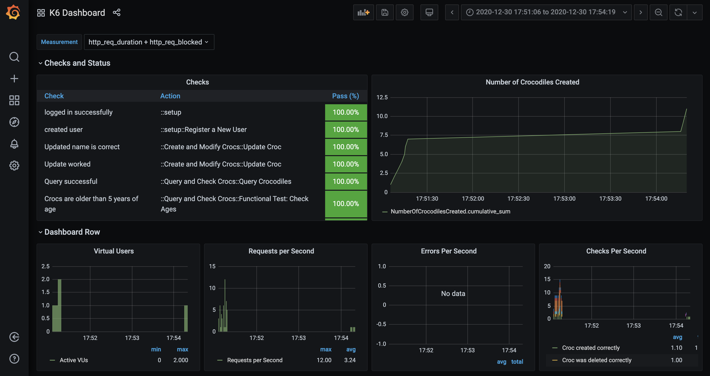

# typescript load testing starter

ユーザーの行動による負荷テストを行い、可視化するツールのスタータキット。

## Description



[K6](https://k6.io/), [Grafana](https://grafana.com/)を利用しユーザーの行動による負荷テストを可視化。 
ローカル上から記述したステップを元にテストを実行し、確認することが出来ます。

## Requirement

- tools
  - docker
  - docker-compose
  - yarn

## Usage

初回のみ、関連パッケージをインストールします。

- `yarn install`

外部ネットワークを事前に作成する必要があるため以下コマンドを実行ください。

- `docker network create k6-network`

ダッシュボードに関連する、influxdb, grafana を起動します。

- `yarn monitors`

K6 で対象のテストを実行する場合は、`k6` のコンテナ経由でテストを実行してください。

- `yarn go:k6`

ブラウザ上で実行結果を確認出来ます。以下 URL から参照してください。

- `http://localhost:3000/d/2jJz71_Wz/k6-dashboard`

実装時は、以下コマンドを実行した状態、もしくはIDEの命名規則に従い、実装を行ってください。

- `yarn check-types:watch`

## network

`k6-network` でネットワークを外部へ解放している。  
別リポジトリのコンテナとのやりとりはこのネットワーク経由で取得ください。

## folder detail

```
src
├── actions    # ユーザーの行動を記述する箇所
│   └── roles  # 各権限ごとのユーザーの行動をexport
├── data       # テスト実行時のデータ群
├── lib        # helper関数群
│   └── types  # 型定義
└── tests      # テスト実行ファイル群
```